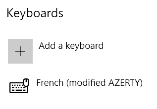

# Clavier français avec majuscules accentuées

Ce dépôt contient des drivers modifiés du clavier standard français AZERTY pour Windows contenant les lettres accentuées `É`, `È`, `À` et `Ç`

Si vous avez la chance d'avoir un clavier Azerty AFNOR vous pouvez récupérer le driver dans un [autre dépôt GitHub](https://github.com/springcomp/optimized-azerty-win).

Mais si comme moi, vous avez un clavier standard AZERTY sous Windows sans pavé numérique, écrire `É` et `Ç` (`È` et `À` c'est possible en tapant <kbd>AltGr+7</kbd>, suivie de <kbd>E</kbd> ou de <kbd>A</kbd>) c'est le parcours du combattant.

Pour faire cela j'ai utilisé le logiciel libre de Microsoft [Keyboard Layout Creator 1.4](https://www.microsoft.com/en-us/download/details.aspx?id=22339).

**Avertissement :** l'application Microsoft Keyboard Layout Creator date de 2007. Elle fonctionne encore parfaitement et fonctionne sous Windows 10, mais il peut arriver que vous rencontriez un bogue.

## Comment j'ai fait

Dans [Keyboard Layout Creator 1.4](https://www.microsoft.com/en-us/download/details.aspx?id=22339) :

1. J'ai fait `File` » `Load Existing Keyboard...` » `French`.
2. J'ai modifié la partie <kbd>Shift</kbd>,<kbd>Alt+Ctrl (AltGr)</kbd> ainsi :

3. Dans `Projects` » `Properties` j'ai mis :

- Name : `frenchua`
- Description : `French (with uppercase accents)`

4. J'ai enregistré la source dans le fichier [FranchUA.klc](FranchUA.klc) qui est disponible ici.
5. J'ai généré les fichiers d'installation avec `Projects` » `Build DLL and Setup Package`.

## Comment installer le driver

### En utilisant l'installation pré-compilée

Vous pouvez trouver l'instillation du driver dans la page des [releases](https://github.com/kpym/frenchua/releases/latest). Vous exécutez le `setup.exe`. Et au final dans les paramètres de Windows vous remplacer le clavier `French (French)` avec `French (with uppercase accents)`.

### En générant l'installation vous-même

1. Vous installez [Keyboard Layout Creator 1.4](https://www.microsoft.com/en-us/download/details.aspx?id=22339).
2. Vous récupérez le code source du clavier [FranchUA.klc](FranchUA.klc).
3. Vous générez les fichiers d'installation avec `Projects` » `Build DLL and Setup Package`.
4. Vous procédez à l'installation comme décrit plus haut.

## Comment utiliser le clavier

Le touches pour obtenir les majuscules accentuées sont :

- `É` = <kbd>Maj.</kbd> + <kbd>AltGr</kbd> + <kbd>é</kbd> ;
- `È` = <kbd>Maj.</kbd> + <kbd>AltGr</kbd> + <kbd>è</kbd> ;
- `Ç` = <kbd>Maj.</kbd> + <kbd>AltGr</kbd> + <kbd>ç</kbd> ;
- `À` = <kbd>Maj.</kbd> + <kbd>AltGr</kbd> + <kbd>à</kbd>.

