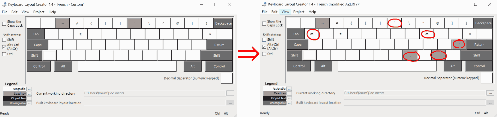

# Clavier AZERTY français modifié

Sur le clavier standard AZERTY sous Windows (surtout sans pavé numérique), écrire `É`, `Ç`, `œ`, `Œ`, `æ` et `Æ` c'est le parcours du combattant.

Ce dépôt contient des drivers modifiés du clavier standard français AZERTY pour Windows qui
- rajoute une touche « accent aigu », ainsi on peut écrire la majuscule `É`, mais aussi `á`, `í`, `ó` ... `Á`, `Í`, `Ó` ... ;
- rajoute une touche « cédille », ainsi on peut écrire la majuscule `Ç` ;
- déplace la touche « accent grave » sur la touche <kbd>AktGr + ù</kbd>, ainsi la touche <kbd>AktGr + è</kbd> (ancienne touche « accent grave ») produit directement <code>`</code> qui sert par exemple dans markdown pour écrire du code ;
- rajoute les touches `œ`, `Œ`, `æ` et `Æ`.

Pour faire cela j'ai utilisé le logiciel libre de Microsoft [Keyboard Layout Creator 1.4](https://www.microsoft.com/en-us/download/details.aspx?id=22339).

**Avertissement :** l'application Microsoft Keyboard Layout Creator date de 2007. Elle fonctionne encore parfaitement et fonctionne sous Windows 10, mais il peut arriver que vous rencontriez un bogue.

**Remzrque :** Si vous avez la chance d'avoir un clavier Azerty AFNOR vous pouvez récupérer le driver dans un [autre dépôt GitHub](https://github.com/springcomp/optimized-azerty-win).

## Comment j'ai fait

Dans [Keyboard Layout Creator 1.4](https://www.microsoft.com/en-us/download/details.aspx?id=22339) :

1. J'ai fait `File` » `Load Existing Keyboard...` » `French`.
2. J'ai modifié la partie <kbd>Shift</kbd>,<kbd>Alt+Ctrl (AltGr)</kbd> ainsi :

3. Dans `Projects` » `Properties` j'ai mis :

- Name : `frenchma`
- Description : `French (modified AZERTY)`

4. J'ai enregistré la source dans le fichier [FranchMA.klc](FranchMA.klc) qui est disponible ici.
5. J'ai généré les fichiers d'installation avec `Projects` » `Build DLL and Setup Package`.

## Comment installer le driver

### En utilisant l'installation pré-compilée

Vous pouvez trouver l'instillation du driver dans la page des [releases](https://github.com/kpym/frenchua/releases/latest). Vous exécutez le `setup.exe`. Et au final dans les paramètres de Windows vous remplacer le clavier `French (French)` avec `French (modified AZERTY)`.

### En générant l'installation vous-même

1. Vous installez [Keyboard Layout Creator 1.4](https://www.microsoft.com/en-us/download/details.aspx?id=22339).
2. Vous récupérez le code source du clavier [FranchUA.klc](FranchMA.klc).
3. Vous générez les fichiers d'installation avec `Projects` » `Build DLL and Setup Package`.
4. Vous procédez à l'installation comme décrit plus haut.

## Comment utiliser le clavier

On note <kbd>/:</kbd> la touche de `:` et de `/`, <kbd>,?</kbd> celle de `,` et de `?`, et ainsi de suite.

<kbd>AltGr + :/</kbd> est la touche de « accent aigu ». Ainsi pour obtenir `É` il suffit de faire <kbd>AltGr + /</kbd> suivie de <kbd>E</kbd>. Mais on peut obtenir par cette méthode aussi `áéíúóýÁÉÍÚÓÝ`.

<kbd>AltGr + ,?</kbd> est la touche de « cédille ». Ainsi pour obtenir `Ç` il suffit de faire <kbd>AltGr + ,</kbd> suivie de <kbd>C</kbd>.

Il y a aussi les caractères :

- `œ` = <kbd>AltGr + o</kbd>
- `Œ` = <kbd>AltGr + O</kbd>
- `æ` = <kbd>AltGr + a</kbd>
- `Æ` = <kbd>AltGr + A</kbd>
- `ß` = <kbd>AltGr + s</kbd> (pas utile en français, mais utile en allemand)

## Fichiers présents dans ce dépôt

- `FranchMA.klc` : le fichier source du clavier AZERTY modifié
- `FrenchMA.log` : le log généré par [Keyboard Layout Creator 1.4](https://www.microsoft.com/en-us/download/details.aspx?id=22339) pour `FranchMA.klc`.
- `Franch.klc` : le fichier source du clavier AZERTY standard
- `French.log` : le log généré par [Keyboard Layout Creator 1.4](https://www.microsoft.com/en-us/download/details.aspx?id=22339) pour `Franch.klc`.
